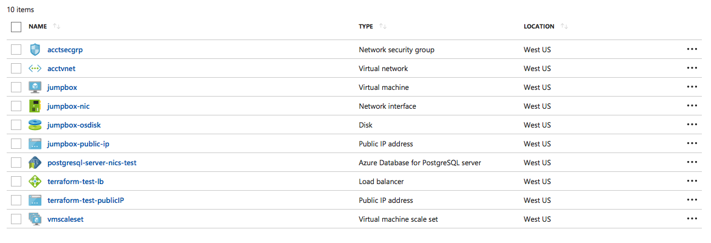

# Example application

## Setup
Set your environment variables for your Azure account, if you do not already have these credentials they can be obtained by using the command line [https://www.terraform.io/docs/providers/azurerm/authenticating_via_service_principal.html](https://www.terraform.io/docs/providers/azurerm/authenticating_via_service_principal.html)

```bash
export TF_VAR_subscription_id="xxxxxxxxxxxxxx"
export TF_VAR_client_id="xxxxxxxxxxxxxx"
export TF_VAR_client_secret="xxxxxxxxxxxxxx"
export TF_VAR_tenant_id="xxxxxxxxxxxxxx"
```

Run `terraform init` to fetch plugins and modules

```bash
$ terraform init
Initializing modules...
- module.network
  Found version 1.1.1 of Azure/network/azurerm on registry.terraform.io
  Getting source "Azure/network/azurerm"
- module.loadbalancer
  Found version 1.0.1 of Azure/loadbalancer/azurerm on registry.terraform.io
  Getting source "Azure/loadbalancer/azurerm"
- module.computegroup
  Found version 1.1.0 of Azure/computegroup/azurerm on registry.terraform.io
  Getting source "Azure/computegroup/azurerm"
- module.computegroup.os
  Getting source "./os"

Initializing provider plugins...
- Checking for available provider plugins on https://releases.hashicorp.com...
- Downloading plugin for provider "azurerm" (0.3.3)...

Terraform has been successfully initialized!

You may now begin working with Terraform. Try running "terraform plan" to see
any changes that are required for your infrastructure. All Terraform commands
should now work.

If you ever set or change modules or backend configuration for Terraform,
rerun this command to reinitialize your working directory. If you forget, other
commands will detect it and remind you to do so if necessary.
```

## Running Terraform
Before applying changes run a `terraform plan` to see what changes will be made by terraform, this is kind of a dry run which will not commit changes

```bash
$ terraform plan
#...

$ terraform apply
#...

azurerm_virtual_machine.jumpbox: Creation complete after 9m6s (ID: /subscriptions/c0a607b2-6372-4ef3-abdb-...rosoft.Compute/virtualMachines/jumpbox)

Apply complete! Resources: 3 added, 1 changed, 0 destroyed.

Outputs:

bastion_host = 104.42.27.44
```



## Accessing the cluster
The cluster is not available for public access without going through the bastion host.  To obtain the ip address of the bastion host you can use the following command `terraform output bastion_host`.
